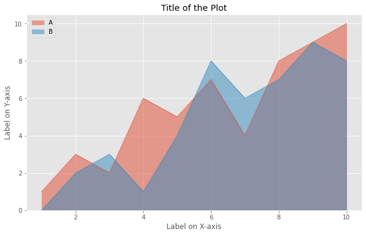

# Area Plot in Python

  

An `area chart` or `area graph` displays graphically quantitative data. It is based on the [`line chart`](https://github.com/Tarun-Kamboj/Data_Visualization_with_Python/blob/master/Line%20Plot). The area between axis and line are commonly emphasized with colors, textures and hatchings. Commonly one compares two or more quantities with an area chart.

The [Notebook here](Notebook.ipynb) contains the code of area plots like the one shown below.

## Thanks for Reading :)
