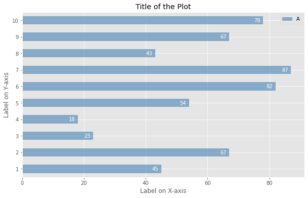

# Bar Chart using Python

## Dependencies

## Introduction

A `bar chart` is a way of representing data where the *length* of the bars represents the magnitude/size of the feature/variable. Bar graphs usually represent numerical and categorical variables grouped in intervals. 

The [Notebook here](Notebook.ipynb) contains the code of bar plots like the one shown below.

## Thanks for Reading :)