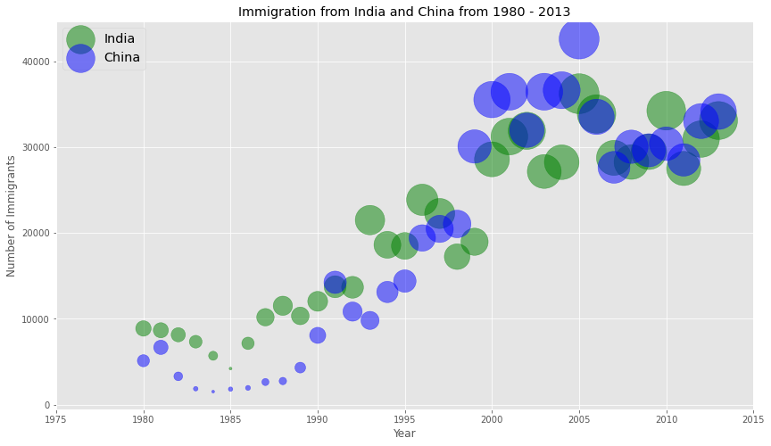

# Bubble Plot

## Dependencies

## Introduction

A `bubble plot` is a variation of the `scatter plot` that displays three dimensions of data (x, y, z). The datapoints are replaced with bubbles, and the size of the bubble is determined by the third variable 'z', also known as the weight. In `maplotlib`, we can pass in an array or scalar to the keyword `s` to `plot()`, that contains the weight of each point.

The [Notebook here](Notebook.ipynb) contains the code of bubble plots like the one shown below.

## Thanks for Reading :)