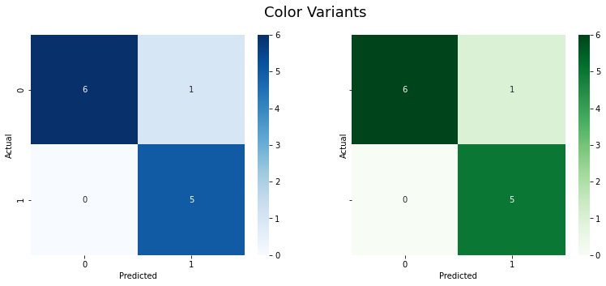

# Confusion Matrices

## Dependencies

## Introduction

In the field of machine learning and specifically the problem of statistical classification, a `confusion matrix`, also known as an error matrix, is a specific table layout that allows visualization of the performance of an algorithm, typically a supervised learning one (in unsupervised learning it is usually called a matching matrix). Each row of the matrix represents the instances in a predicted class, while each column represents the instances in an actual class (or vice versa). The name stems from the fact that it makes it easy to see whether the system is confusing two classes (i.e. commonly mislabeling one as another).

It is a special kind of contingency table, with two dimensions ("actual" and "predicted"), and identical sets of "classes" in both dimensions (each combination of dimension and class is a variable in the contingency table).

The [Notebook here](Notebook.ipynb) contains the code of confusion matrices like the ones shown below.

## Thanks for Reading :)