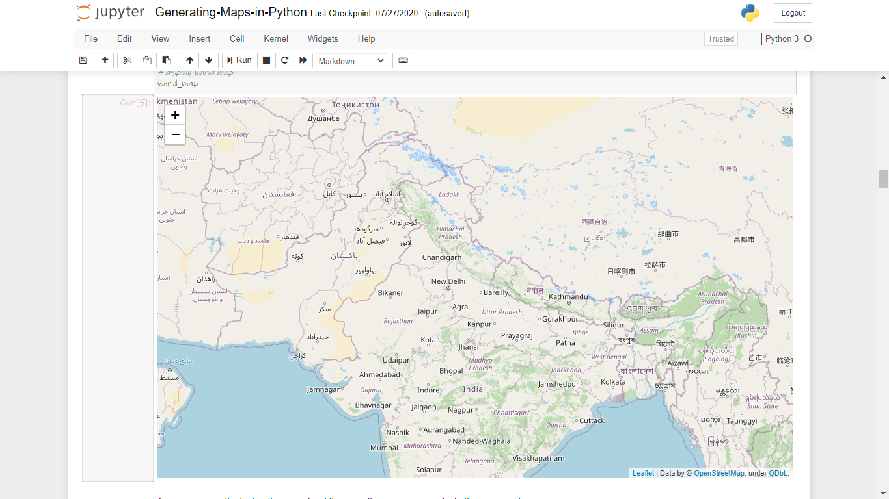

# Maps in Python

## Dependencies

**Note : The notebook is not opening properly here in GitHub, so you are requested to clone the repo or download it and then try accessing it locally.**

## Introduction

In the [Notebook here](Notebook.ipynb), we will explore how to create maps for different objectives. To do that, we will work with Python visualization library, namely Folium. What is nice about Folium is that it was developed for the sole purpose of visualizing geospatial data. While other libraries are available to visualize geospatial data, such as plotly, they might have a cap on how many API calls you can make within a defined time frame. Folium, on the other hand, is completely free.

We'll generate from simple maps to advance maps such as Choropleth maps as shown below. 

|  |  |
|---|---|

## Thanks for Reading :)