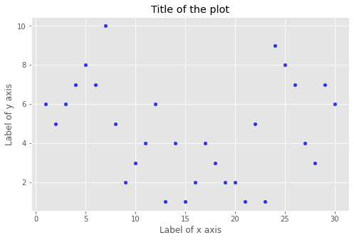

# Scatter Plot

## Dependencies

## Introduction

A `scatter plot` is a type of plot or mathematical diagram using Cartesian coordinates to display values for typically two variables for a set of data. If the points are coded (color/shape/size), one additional variable can be displayed. The data are displayed as a collection of points, each having the value of one variable determining the position on the horizontal axis and the value of the other variable determining the position on the vertical axis.

The [Notebook here](Notebook.ipynb) contains the code of bar plots like the one shown below.

## Thanks for Reading :)