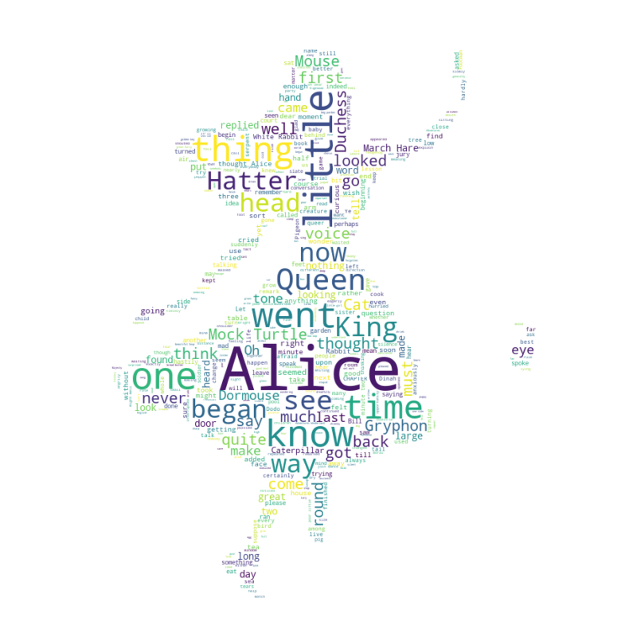

# Word Clouds

## Dependencies

## Introduction

Word clouds (also known as text clouds or tag clouds) work in a simple way: the more a specific word appears in a source of textual data (such as a speech, blog post, or database), the bigger and bolder it appears in the word cloud. Word clouds are commonly used to perform high-level analysis and visualization of text data.

The [Notebook here](Notebook.ipynb), contains the code of simple as well as advanced word clouds as shown below.

## Thanks for Reading :)