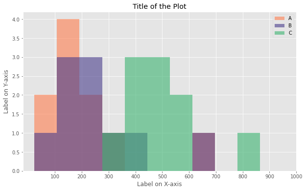

# Histogram in Python

  

A `Histogram` is a way of representing the frequency distribution of numeric dataset. The way it works is it partitions the x-axis into bins, assigns each data point in our dataset to a bin, and then counts the number of data points that have been assigned to each bin. So the y-axis is the frequency or the number of data points in each bin.

The [Notebook here](Notebook.ipynb) contains the code of Histograms like the one shown below.

## Thanks for Reading :)
