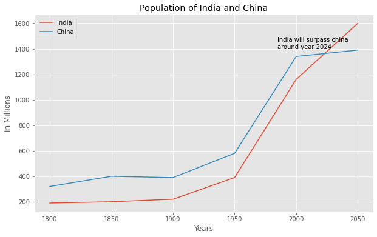

# Line Plots

## Dependencies

## Introduction

A `line chart` or `line plot` or `line graph` or `curve chart` is a type of chart which displays information as a series of data points called 'markers' connected by straight line segments. It is a basic type of chart common in many fields. It is similar to a scatter plot except that the measurement points are ordered (typically by their x-axis value) and joined with straight line segments. A line chart is often used to visualize a trend in data over intervals of time (a time series) thus the line is often drawn chronologically. In these cases they are known as run charts.

The [Notebook here](Notebook.ipynb) contains the code of line plots like the one shown below.

## Thanks for Reading :)
