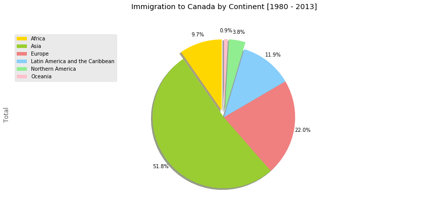

# Pie Charts

## Dependencies

## Introduction

A `pie chart` (or a circle chart) is a circular statistical graphic, which is divided into slices to illustrate numerical proportion. In a pie chart, the arc length of each slice (and consequently its central angle and area), is proportional to the quantity it represents. 

While it is named for its resemblance to a pie which has been sliced, there are variations on the way it can be presented. Pie charts are very widely used in the business world and the mass media.

The [Notebook here](Notebook.ipynb) contains the code of pie charts like the one shown below.

## Thanks for Reading :)