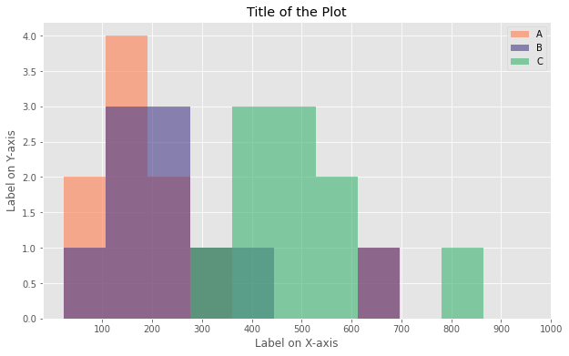
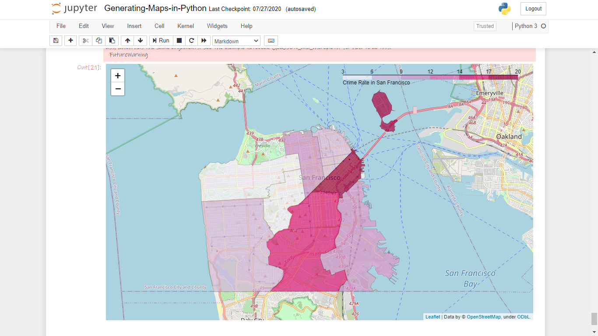

	

	
	
	
	
	
	
	

## About the Repo

This repository contains code for various plots made in python. Following are the links for the same.

<h3>

	
 Line Plot

	<table>
		<th><a href="Code/Line%20Plot">Visit Directory ↗</a></th>
		<th></th>
	</table>

</h3>
<h3>

	
 Area Plot

	<table>
		<th><a href="Code/Area%20Plot">Visit Directory ↗</a></th>
		<th></th>
	</table>

</h3>
<h3>

	
 Scatter Plot

	<table>
		<th><a href="Code/Scatter%20Plot">Visit Directory ↗</a></th>
		<th></th>
	</table>

</h3>
<h3>

	
 Histogram

	<table>
		<th><a href="Code/Histogram">Visit Directory ↗</a></th>
		<th></th>
	</table>

</h3>
<h3>

	
 Bar Chart

	<table>
		<th><a href="Code/Bar%20Chart">Visit Directory ↗</a></th>
		<th></th>
	</table>

</h3>
<h3>

	
 Pie Chart

	<table>
		<th><a href="Code/Pie%20Chart">Visit Directory ↗</a></th>
		<th></th>
	</table>

</h3>
<h3>

	
 Confusion Matrix

	<table>
		<th><a href="Code/Confusion%20Matrix">Visit Directory ↗</a></th>
		<th></th>
	</table>

</h3>
<h3>

	
 Bubble Plot

	<table>
		<th><a href="Code/Bubble%20Plot">Visit Directory ↗</a></th>
		<th></th>
	</table>

</h3>
<h3>

	
 Waffle Chart

	<table>
		<th><a href="Code/Waffle%20Chart">Visit Directory ↗</a></th>
		<th></th>
	</table>

</h3>
<h3>

	
 Word Cloud

	<table>
		<th><a href="Code/Word%20Cloud">Visit Directory ↗</a></th>
		<th></th>
	</table>

</h3>
<h3>

	
 Maps

	<table>
		<th><a href="Code/Maps">Visit Directory ↗</a></th>
		<th></th>
	</table>

</h3>

## Thanks for Reading :)

[MIT License](LICENSE) Copyright (c) 2021, 

Author - [Tarun Kamboj](https://github.com/Tarun-Kamboj).